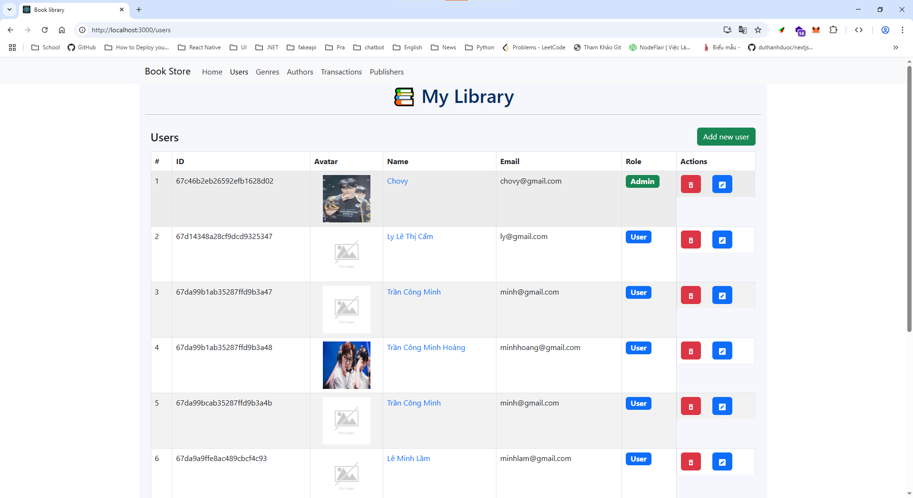
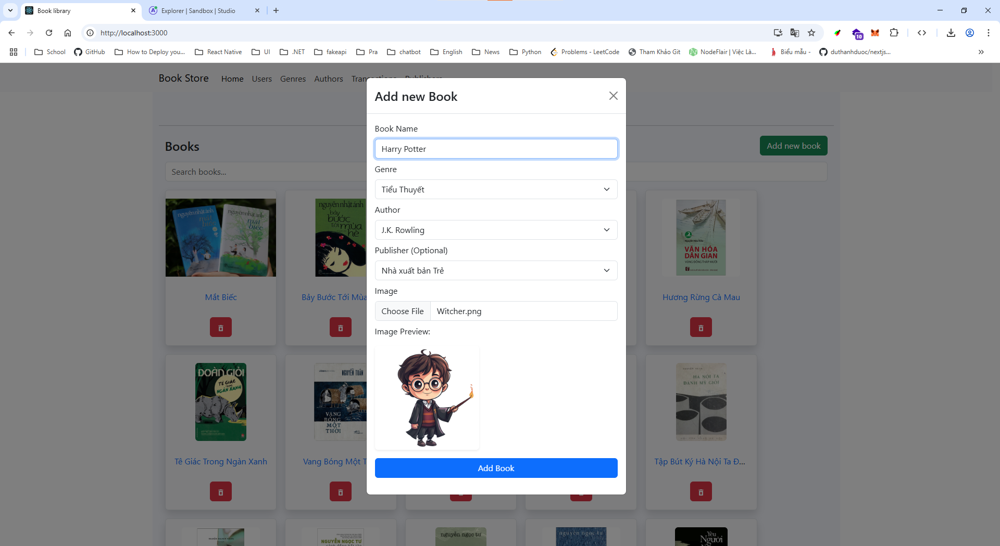

# Book CRUD with React, NodeJS, GraphQL with Apollo

This project is a simple CRUD (Create, Read, Update, Delete) application for managing books. It is built using ReactJS on the front-end and GraphQL with Apollo Client for handling data fetching, state management, and communication with the server. This project is developed for internal use only.

## 🚀 Features

> User Management

- Manage user accounts (readers and administrators).

- User roles: user, admin.

- Secure login with email and password.

> Book Management

- View a list of all books.

- View detailed information for each book.

- Add new books with author and genre.

- Edit existing book details.

- Delete books.

> Author Management

- Add, update, and remove authors.

- View author information, including age.

> Genre Management

- Manage book genres.

- Add, update, and delete genres with descriptions.

> Publisher Management

- Manage publisher information.

- Store and update publisher name, address, and contact.

> Transaction Management

- Track borrowing and returning of books.

- Monitor borrow date, due date, and return date.

- Status tracking: borrowed, returned, overdue.

- Late return handling with fine calculation.

- Fine status management (paid, unpaid, none).

## Authentication and Authorization

- **Authentication (Login Process)**

  - Authentication is the process of verifying the identity of a user. In this case, users will log in with their email and password, and upon successful verification, a JWT (JSON Web Token) will be generated and sent back to the client.

_Logic Authentication_

- User submits login form with email and password.

- Backend checks credentials: The server verifies the provided email and password against the user database.

- JWT Generation: Upon successful login, the server generates a JWT containing the user's information (such as user ID and role).

- Send Token to Client: The JWT is sent as a response, typically as part of a JSON response body.

- **Storing Token in Cookie**

  - Once the JWT is generated, it needs to be securely stored on the client-side to ensure the user remains authenticated between page refreshes.

- **Authorization (Role-Based Access Control)**
  - Authorization determines what actions a user is allowed to perform based on their role or permissions. In this case, we have different user roles (admin, user).

_Role-Based Authorization:_

- User Roles: When a user logs in, their role (admin, user) is included in the JWT token. This role helps the server determine what the user is allowed to do.

- Access Control: When the client makes requests, the server uses the role from the JWT token to check if the user has permission to perform the requested action.

## 🛠️ Tech Stack

- **Frontend:**
  - ReactJS
  - Apollo Client
  - Bootstrap (for UI components)
- **Backend:**
  - NodeJS
  - API: GraphQL
  - Apollo Server
  - Database: MongoDB

## Run project

- **Front-end:**
  - yarn start or npn start
- **Back-end:**
  - yarn server

### Results:

