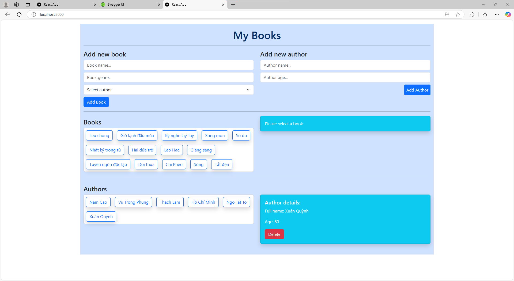

# Book CRUD with React, GraphQL, and Apollo

This project is a simple CRUD (Create, Read, Update, Delete) application for managing books. It is built using ReactJS on the front-end and GraphQL with Apollo Client for handling data fetching, state management, and communication with the server.

## Features

- View a list of books.
- View details of a selected book.
- Add a new book.
- Edit an existing book.
- Delete a book.

## Tech Stack

- **Frontend:**
  - ReactJS
  - Apollo Client
  - Bootstrap (for UI components)
- **Backend:**
  - GraphQL
  - Apollo Server (not included in this project, but can be used with the backend)
  - NodeJS, ExpressJS

## Result:

