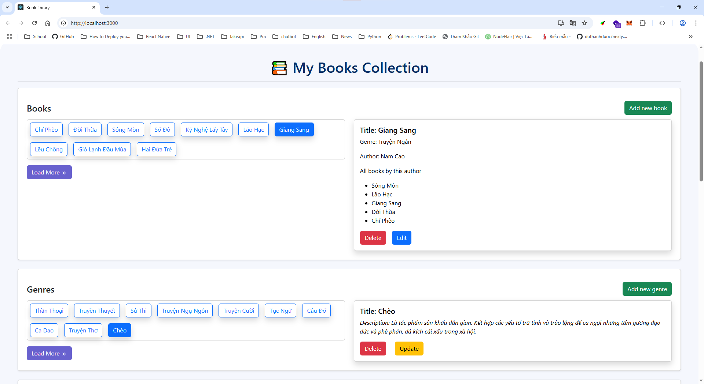
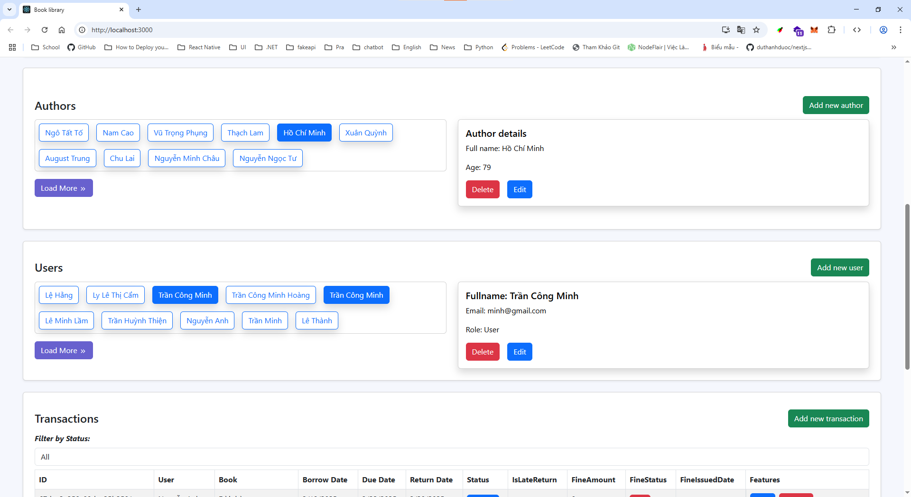
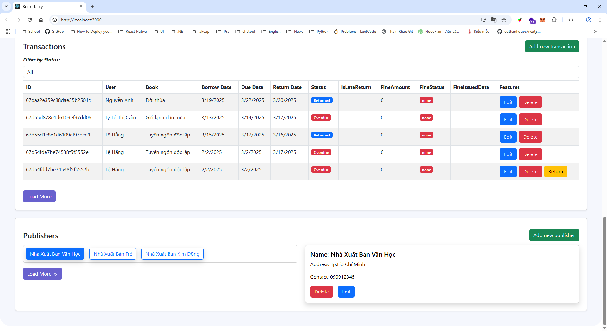

# Book CRUD with React, NodeJS, GraphQL with Apollo

This project is a simple CRUD (Create, Read, Update, Delete) application for managing books. It is built using ReactJS on the front-end and GraphQL with Apollo Client for handling data fetching, state management, and communication with the server.

## 🚀 Features

> User Management

- Manage user accounts (readers and administrators).

- User roles: user, admin.

- Secure login with email and password.

> Book Management

- View a list of all books.

- View detailed information for each book.

- Add new books with author and genre.

- Edit existing book details.

- Delete books.

> Author Management

- Add, update, and remove authors.

- View author information, including age.

> Genre Management

- Manage book genres.

- Add, update, and delete genres with descriptions.

> Publisher Management

- Manage publisher information.

- Store and update publisher name, address, and contact.

> Transaction Management

- Track borrowing and returning of books.

- Monitor borrow date, due date, and return date.

- Status tracking: borrowed, returned, overdue.

- Late return handling with fine calculation.

- Fine status management (paid, unpaid, none).

## 🛠️ Tech Stack

- **Frontend:**
  - ReactJS
  - Apollo Client
  - Bootstrap (for UI components)
- **Backend:**
  - NodeJS
  - API: GraphQL
  - Apollo Server
  - Database: MongoDB

### Results:

